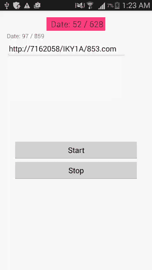

# RandomAnimationText

## Examples



#####Types for random animation:
```
A - alphanumeric;
a - alphabet;
n - numeric;
```
#####Template and rules:
```
Template contains %s 
Example: Data %s / %s 

Rules contains type (A or a or n) and length string for random animation and divider : 
Example: n2:A3:a10
```

####Init template and rules:
```
<string name="rules" formatted="false">n2:n3</string>
<string name="template" formatted="false">Date: %s / %s</string>

In xml:
<com.azoft.random.RandomTextView
  ...
  randomText:autoStart="true"
  randomText:rules="@string/rules"
  randomText:template="@string/template"/>

In code:
randomTextView.startTextAnimation(getString(R.string.template),getString(R.string.rules));
```

#### Contact ####

Feel free to get in touch.

    Website:    http://www.azoft.com
    Twitter:    @azoft
    LinkedIn:   https://www.linkedin.com/company/azoft
    Facebook:   https://www.facebook.com/azoft.company
    Email:      android-mobile@azoft.com

#### License ####

    Licensed under the Apache License, Version 2.0 (the "License");
    you may not use this file except in compliance with the License.
    You may obtain a copy of the License at

       http://www.apache.org/licenses/LICENSE-2.0

    Unless required by applicable law or agreed to in writing, software
    distributed under the License is distributed on an "AS IS" BASIS,
    WITHOUT WARRANTIES OR CONDITIONS OF ANY KIND, either express or implied.
    See the License for the specific language governing permissions and
    limitations under the License.
